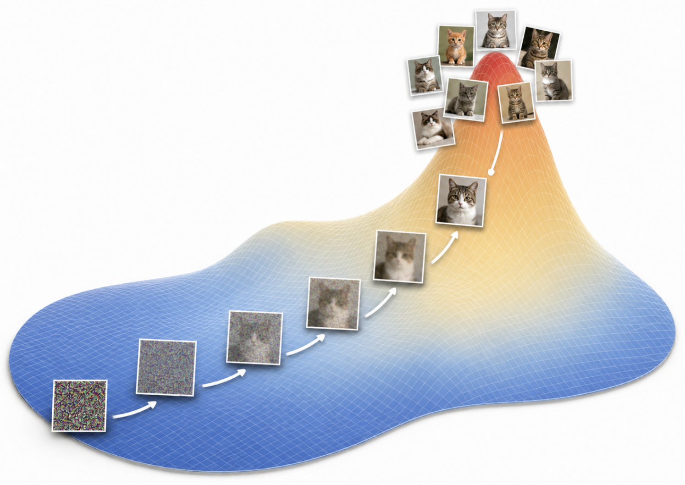

## About Me

I am an undergraduate student at Korea University, majoring in Biomedical Engineering and Electrical Engineering. I am currently an undergraduate researcher at MIPL, where I work on medical imaging, gamma-camera data processing, and AI-based approaches for imaging and signal analysis.

My academic background combines biomedical engineering, electrical engineering, signal processing, and machine learning. I am interested in medical AI, inverse problems, and generative models, especially in applications involving scientific and biomedical data.

Through my research experience and personal projects, I aim to develop a deeper understanding of how AI methods can be connected with real measurement systems and domain-specific data.

I use this site to organize my research experience, projects, and study notes.

## Interests

- Signal Processing
- Inverse Problems
- Generative Models
- Scientific and Biomedical Data
- Medical AI
- Medical Imaging

## News

- **[Jul 2026]** Launched this personal portfolio website.

## Projects

- Development of an Automated Pipeline to Generate Segmentation Maps for Gamma Camera Calibration Using Deep LearningDeveloped an end-to-end automated pipeline for gamma-ray imaging calibration by integrating a U-Net-based peak detection model with a self- and cross-attention-based point set registration algorithm. The system automates the generation of segmentation maps, reducing calibration time from approximately 5 minutes of manual work to under 10 seconds while improving the efficiency and consistency of the gamma camera calibration process.
- Generative Model-Based Background Signal Separation for Gamma Detectors and Radioisotope Identification<em>In progress.</em>

## Study Notes

<ol class="bibliography">
<li>

  

    
  

  

    
<a href="https://velog.io/@schnwn/DDPM" target="_blank" rel="noopener">[Paper Review] Denoising Diffusion Probabilistic Model (2020) and Generative Models</a>

    
Study note on diffusion models and generative modeling

    
<em>Velog, Jul 2026.</em>

    

      <a href="https://velog.io/@schnwn/DDPM" class="btn btn-sm z-depth-0" role="button" target="_blank" rel="noopener" style="font-size:12px;">Read</a>
    

  

</li>
</ol>

